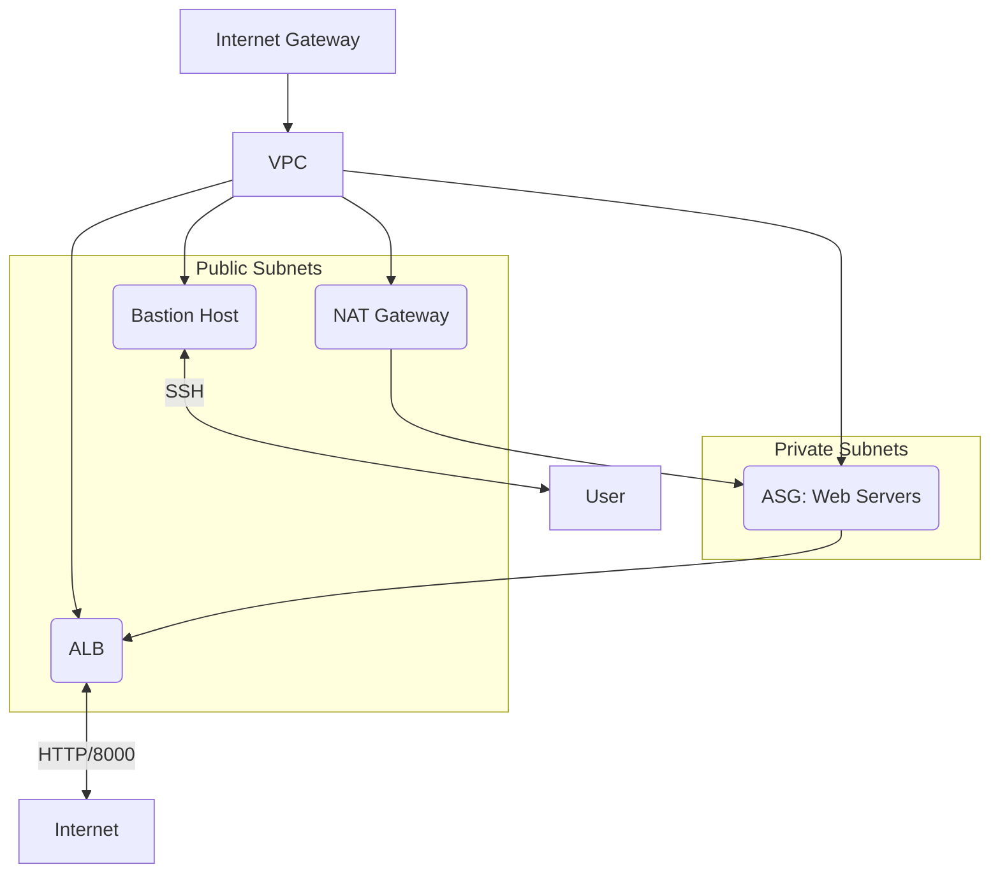

# Terraform AWS NAT, ALB, and Auto Scaling Group Example

This project provisions a highly available AWS infrastructure using Terraform. It includes a VPC, public and private subnets, NAT Gateways, an Application Load Balancer (ALB), an Auto Scaling Group (ASG) for web servers, a Bastion host, and all necessary networking and security resources.

---

## Architecture Diagram




---

## Features

- **VPC** with public and private subnets across multiple Availability Zones
- **Internet Gateway** for public subnet internet access
- **NAT Gateways** for private subnet outbound internet access
- **Bastion Host** in the public subnet for secure SSH access
- **Application Load Balancer (ALB)** for distributing HTTP traffic
- **Auto Scaling Group (ASG)** for web servers in private subnets
- **Security Groups** for controlled access
- **User Data Scripts** for web server initialization
- **Outputs** for easy access to important endpoints

---

## Project Structure

```
.
├── alb.tf
├── auto_scaling_group.tf
├── instances.tf
├── internet_gateway.tf
├── main.tf
├── nat_gateway.tf
├── output.tf
├── route_tables.tf
├── security_groups.tf
├── subnets.tf
├── userdata1.sh
├── userdata2.sh
├── variables.tf
└── README.md
```

---

## Prerequisites

- [Terraform](https://www.terraform.io/downloads.html) v1.0+
- AWS CLI configured with appropriate credentials
- An existing AWS key pair (update `key_name` in `variables.tf`)

---

## Usage

### 1. Clone the Repository

```sh
git clone https://github.com/mohansaravanan21/tf_aws_nat_asg.git
cd tf_aws_nat_asg
```

### 2. Initialize Terraform

```sh
terraform init
```

### 3. Review and Customize Variables

Edit `variables.tf` to adjust region, subnet CIDRs, availability zones, instance type, AMI ID, key name, and user data scripts as needed.

### 4. Plan the Deployment

```sh
terraform plan
```

### 5. Apply the Configuration

```sh
terraform apply
```

Type `yes` when prompted to confirm.

---

## Outputs

After a successful apply, Terraform will output:

- **ALB DNS Name**: The public endpoint for your web servers
- **Bastion Host Public IP**: Use this IP to SSH into your Bastion host

---

## File Descriptions

- **alb.tf**: ALB, target group, and listener resources
- **auto_scaling_group.tf**: Launch template and ASG for web servers
- **instances.tf**: Bastion host EC2 instance
- **internet_gateway.tf**: Internet Gateway for VPC
- **nat_gateway.tf**: NAT Gateways and Elastic IPs for private subnet internet access
- **output.tf**: Useful outputs (ALB DNS, Bastion IP)
- **route_tables.tf**: Route tables and associations for public/private subnets
- **security_groups.tf**: Security groups and rules for all resources
- **subnets.tf**: Public and private subnets in multiple AZs
- **userdata1.sh / userdata2.sh**: User data scripts for web server initialization
- **variables.tf**: Input variables for customization
- **main.tf**: Entry point (resources are split into separate files)

---

## Accessing Your Infrastructure

- **Web Application**: Visit the ALB DNS name output by Terraform to access your web servers.
- **Bastion Host**: SSH using the public IP and your private key:
  ```sh
  ssh -i /path/to/your-key.pem ubuntu@<bastion_public_ip>
  ```

---

## Cleanup

To destroy all resources and avoid AWS charges:

```sh
terraform destroy
```

---

## Notes

- Ensure your AWS account has sufficient permissions and quotas.
- The AMI ID in `variables.tf` should be valid for your chosen region.
- The user data scripts (`userdata1.sh`, `userdata2.sh`) can be customized for your application.

---

## License

This project is licensed under the MIT License.

---

## Author

- [Mohan Saravanan](https://github.com/mohansaravanan21)
